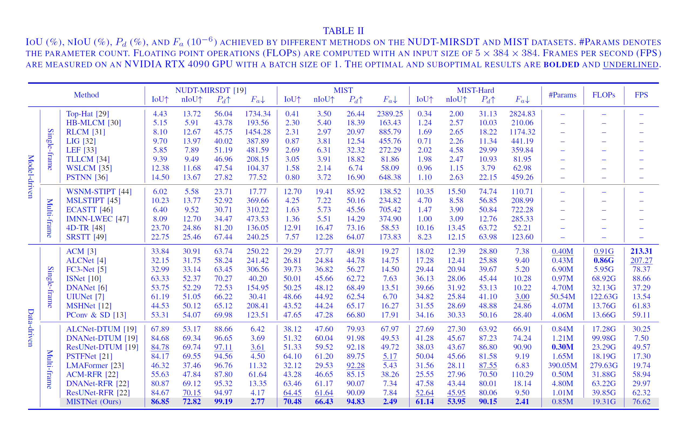

# MIST: A Benchmark and Baseline for Multi-frame Infrared Small Target Detection in Complex Motion

Dataset and Code for the Paper "MIST: A Benchmark and Baseline for Multi-frame Infrared Small Target Detection in Complex Motion" (Submitted to IEEE TIP)

## Contributions
* We release MIST, a challenging multi-frame infrared small target detection (MISTD) dataset built on a synthetic data engine. This dataset covers scenarios where targets have low SCR and complex motion, featuring diverse target/background characteristics and precise annotations. 
* Based on the Information Bottleneck theory, we develop a simple yet effective baseline called MISTNet for MISTD. Our method is robust in handling irregular and fast motion while resisting target-irrelevant interference. 

## Installation

### Prerequisites

- Python 3.8 or higher
- PyTorch 1.10.1 or higher
- [NATTEN](https://natten.org/) 0.14.6

1. **Create a new Conda environment:**

```bash
conda create -n Deep-MIST python=3.8
conda deactivate
conda activate Deep-MIST
```

2. **Install PyTorch with CUDA support:**

```bash
pip install torch==1.10.1+cu113 torchvision==0.11.2+cu113 -f https://download.pytorch.org/whl/cu113/torch_stable.html
```

3. **Install additional packages:**

```bash
pip install -r requirements.txt
```

1. **Install NATTEN using our downloaded wheels [Google Drive](https://drive.google.com/file/d/1kjhM7p4P2RZ1Wdus5E6sP4cIFzipBiGk/view?usp=sharing) (or you can refer to the [official install instructions](https://github.com/SHI-Labs/NATTEN/releases/tag/v0.14.6)):**

```bash
pip install natten-0.14.6+torch1101cu113-cp38-cp38-linux_x86_64.whl
```

## Dataset

The MIST dataset is available at [Google Drive](https://drive.google.com/file/d/1jJabpOzmuLgxa52V1dtBuXv5-RpKNiSn/view?usp=sharing). You can download the dataset and put it under the ``./data/`` directory (create the directory if it does not exist).

MIST is a large-scale dataset for airborne infrared detection scenarios. The dataset is built on a synthetic data engine that models variations in pose, size, and intensity of moving targets while seamlessly blending them into real backgrounds for physical, geometric, and visual realism. Targets in MIST exhibit low signal-to-clutter ratios and complex motion, making it a promising yet challenging benchmark for developing algorithms focused on motion analysis.

We split MIST into a training set of 78 sequences and a test set of 42 sequences. To rigorously assess the robustness of different methods against low SCR and complex motion, we carefully curate a more challenging subset (11 sequences) from the test set, named MIST-Hard. Targets in this subset are characterized by extremely low SCR (≤1), highly irregular trajectories, and ultra-high speeds (>7 pixels/frame).

## Baseline

To tackle the challenges of MIST, we develop MISTNet, a robust baseline based on the Information Bottleneck theory. To handle irregular and fast motion, we propose a shifted neighborhood compensation block to efficiently model multi-scale correspondences for implicit motion compensation. To distill compact representations free from irrelevant cues, we design a progressive distillation decoder to hierarchically filter out redundancy while preserving target-relevant information.

## Train on MIST

Please refer to the configuration file ``./configs/train_MISTNet_MIST.yaml`` for detailed training settings. With a batch size of 16, the model is trained using two 24 GB GPUs.

```bash
python train.py --config './configs/train_MISTNet_MIST.yaml'
```

## Test on MIST

```bash
python test.py --config './configs/test_MISTNet_MIST.yaml'
```

## Train on NUDT-MIRSDT

```bash
python train.py --config './configs/train_MISTNet_NUDTMIRSDT.yaml'
```

## Test on NUDT-MIRSDT

```bash
python test.py --config './configs/test_MISTNet_NUDTMIRSDT.yaml'
```

## Results and Trained Model Weights

The trained model weights are available at [Google Drive](https://drive.google.com/file/d/15Cu1G8Zga-tWszSByex5bb3x2VRfH2yW/view?usp=sharing).



## Citiation

## Contact
Welcome to raise issues or email to [ruigao@shu.edu.cn](ruigao@shu.edu.cn) for any question.